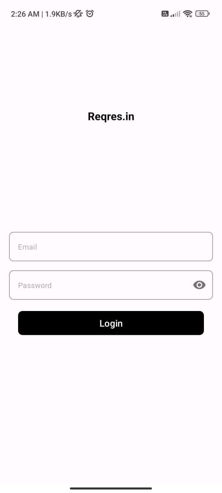
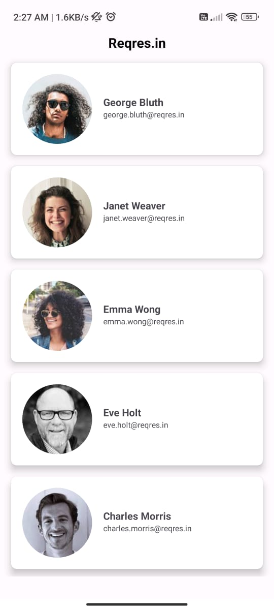

# Reqres User App

## Screenshot
|Splash Screen|Login Screen|List Users Screen|
|--|--|--|
||||

## Features
- Login
- List Users

## Layers
- **Domain** - Contains the business logic of the application. It is the individual and innermost module. It’s a complete java module.
- **Data** It includes the domain layer. It would implement the interface exposed by domain layer and dispenses data to app
- **Presentation** - A layer that interacts with the UI, mainly Android Stuff like Activities, Fragments, ViewModel, etc. It would include both domain and data layers.

## Build With
- [Kotlin](https://kotlinlang.org/) - First class and official programming language for Android development.
- [Coroutines](https://kotlinlang.org/docs/reference/coroutines-overview.html) - Is light wight threads for asynchronous programming
- [Flow](https://developer.android.com/kotlin/flow) - Handle the stream of data asynchronously that executes sequentially.
- [Android Architecture Components](https://developer.android.com/topic/libraries/architecture) - Collection of libraries that help you design robust, testable, and maintainable apps.
    - [LiveData](https://developer.android.com/topic/libraries/architecture/livedata) - Data objects that notify views when the underlying database changes.
    - [ViewModel](https://developer.android.com/topic/libraries/architecture/viewmodel) - Stores UI-related data that isn't destroyed on UI changes.
    - [ViewBinding](https://developer.android.com/topic/libraries/view-binding) - Generates a binding class for each XML layout file present in that module and allows you to more easily write code that interacts with views.
    - [Paging 3](https://developer.android.com/topic/libraries/architecture/paging/v3-overview) - The Paging library helps you load and display pages of data from a larger dataset from local storage or over network.
- [Dependency Injection](https://developer.android.com/training/dependency-injection) dependency injection is a technique where by one object (or static method) supplies the dependencies of another object. A dependency is an object that can be used (a service).
    - [Hilt-android](https://dagger.dev/hilt/) Hilt provides a standard way to incorporate Dagger dependency injection into an Android application.
- [Retrofit](https://square.github.io/retrofit/) - A type-safe HTTP client for Android and Java.
- [OkHttp](http://square.github.io/okhttp/) An HTTP & HTTP/2 client for Android and Java applications.
- [Gson](https://github.com/google/gson) A Java serialization/deserialization library to convert Java Objects into JSON and back
- [Glide](https://github.com/bumptech/glide) An image loading and caching library for Android focused on smooth scrolling
- [Material Design](https://material.io/develop/android/docs/getting-started) Material is a design system created by Google to help teams build high-quality digital experiences for Android, iOS, Flutter, and the web.